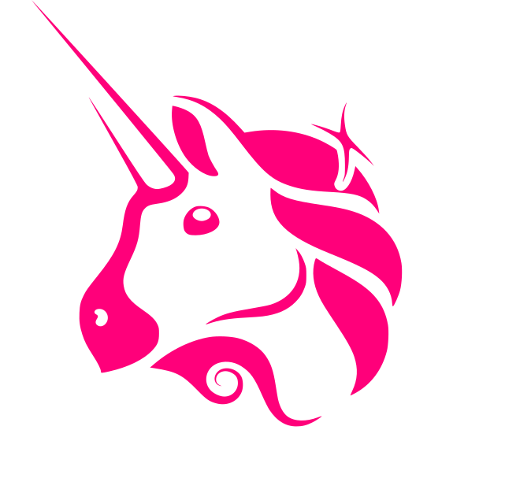

<!--suppress HtmlDeprecatedAttribute -->
# Hello! 👋 I am a Blockchain Developer & Web3 Engineer

 
- 🔭 Full-stack developer with 8+ years of experience designing and building scalable, high-performance blockchain, web applications 
- 🌱 Proficient in front-end technologies like React, Angular, and Vue.js, as well as back-end technologies like Node.js, Python, and PHP 
- 👍 Experienced in DevOps, CI/CD, and Cloud infrastructure, especially with AWS and Azure also GCP 
- 😍 Developed some AI Apps and integrated with web and ChatGPT. 
- 😉 Deep knowledge about deep learning, recommendation system and reinforcement system. 
- ⛓️ Blockchain Developer & Web3 Engineer — building secure, scalable, and production-ready dApps, smart contracts, and DeFi protocols 
- 🔐 Specializing in EVM ecosystem (Ethereum, Polygon), Solana (Rust/Anchor), Stellar, and Zero Knowledge Proof systems (Aztec, Noir, Light Protocol) 
- 🛠️ Expert in smart contract development & auditing, token standards (ERC-20, ERC-721, ERC-1155, ERC-4337), Account Abstraction, Multisig Wallets, Diamond Proxy (EIP-2535), and Vesting Contracts 

<h3 align="left">Languages and Tools:</h3>

<table align="center">
  <tr>
    <td align="center" width="96">
        
       React
    </td>
    <td align="center" width="96">
        
       Python
    </td>
    <td align="center" width="96">
        
       JavaScript
    </td>
    <td align="center" width="96">
        
       TypeScript
    </td>
    <td align="center" width="96">
        
       C++
    </td>
    <td align="center" width="96">
        
       C#
    </td>
    <td align="center" width="96">
        
       AWS
    </td>
    <td align="center" width="96">
        
       MySQL
    </td>
    <td align="center" width="96">
        
       Github
    </td>
  </tr>
  <tr>
    <td align="center" width="96">
        
       Git
    </td>
    <td align="center" width="96">
        
       PHP
    </td>
    <td align="center" width="96">
        
       HTML5
    </td>
    <td align="center" width="96">
        
       CSS
    </td>
    <td align="center" width="96">
        
       Bootstrap
    </td>
    <td align="center" width="96">
        
       Tailwind
    </td>
    <td align="center" width="96">
        
       Node.js
    </td>
    <td align="center" width="96">
        
       MongoDB
    </td>
    <td align="center" width="96">
        
       PostgreSQL
    </td>
  </tr>
  <tr>
    <td align="center" width="96">
        
       VS Code
    </td>
    <td align="center" width="96">
        
       Docker
    </td>
    <td align="center" width="96">
        
       GraphQL
    </td>
    <td align="center" width="96">
        
       Redis
    </td>
    <td align="center" width="96">
        
       Polygon
    </td>
    <td align="center" width="96">
        
       Stellar
    </td>
    <td align="center" width="96">
        
       Payload CMS
    </td>
    <td align="center" width="96">
        
       motion.dev
    </td>
    <td align="center" width="96">
        
       Passenger
    </td>
  </tr>
  <tr>
    <td align="center" width="96">
        
       Solidity
    </td>
    <td align="center" width="96">
        
       Rust
    </td>
    <td align="center" width="96">
        
       Ethereum
    </td>
    <td align="center" width="96">
        
       Solana
    </td>
    <td align="center" width="96">
        
       Hardhat
    </td>
    <td align="center" width="96">
        
       Foundry
    </td>
    <td align="center" width="96">
        
       Web3.js
    </td>
    <td align="center" width="96">
        
       Aztec
    </td>
    <td align="center" width="96">
        
       ZK
    </td>
  </tr>
  <tr>
    <td align="center" width="96">
        
       ERC-4337
    </td>
    <td align="center" width="96">
        
       Multisig
    </td>
    <td align="center" width="96">
        
       DeFi
    </td>
  </tr>
</table>

 <picture>
  <source media="(prefers-color-scheme: dark)" srcset="https://raw.githubusercontent.com/Vaibhav2002/Vaibhav2002/output/github-contribution-grid-snake-dark.svg" />
  <source media="(prefers-color-scheme: light)" srcset="https://raw.githubusercontent.com/Vaibhav2002/Vaibhav2002/output/github-contribution-grid-snake.svg" />
  
</picture>

  

